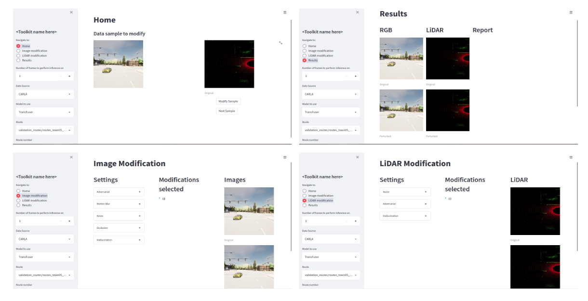
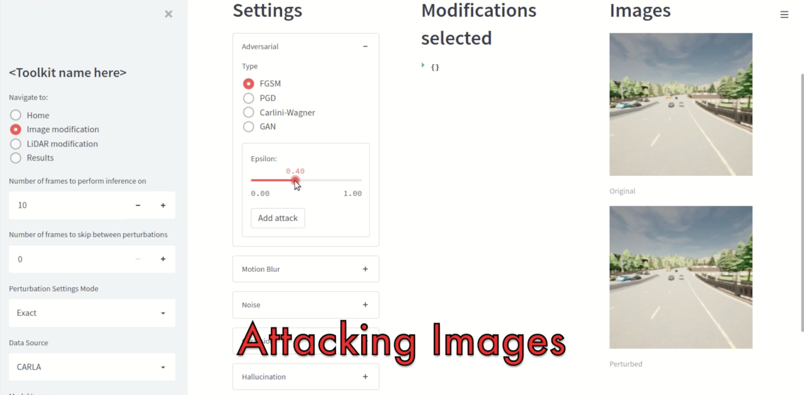
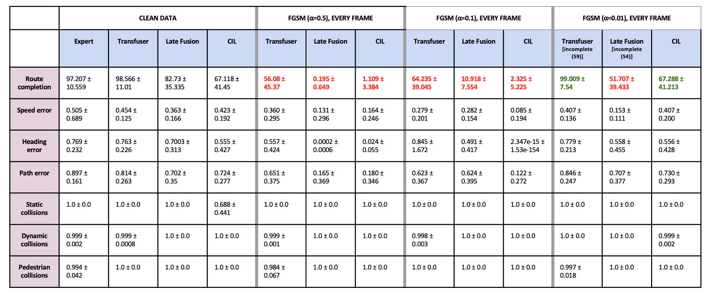
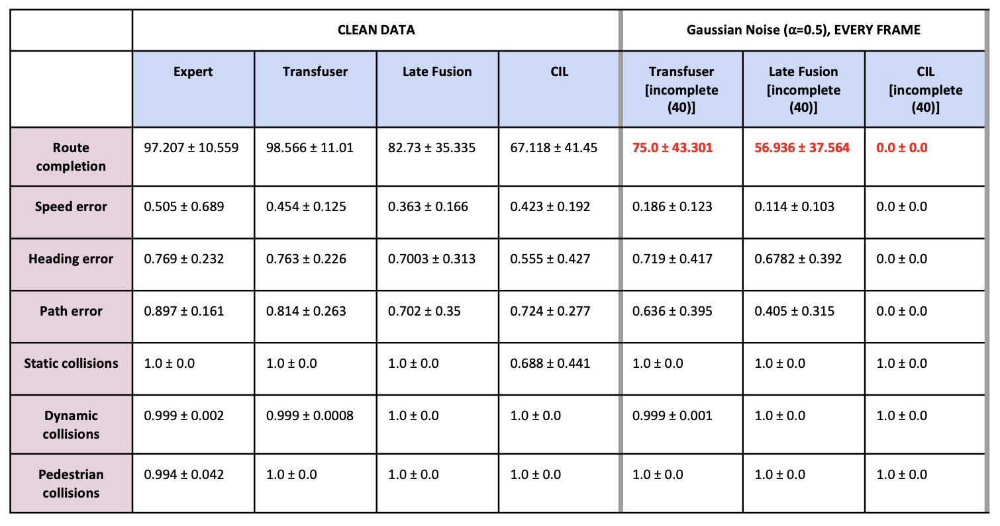

# \<Toolkit name here\>

Test robustness of navigation models for route completion tasks.


*Toolkit Layout*


## Example
Applying various attacks to the Late Fusion model along Route 01 in Town05 Short.

[](assets/LF_Town05Short_Route0_various_attacks.mp4)


## Installation

1. Install CARLA 0.9.11. Follow the instructions provided [here](https://carla.readthedocs.io/en/0.9.11/start_quickstart/#carla-installation).
1. Clone this repo
    
    ```bash
    git clone <https://gitlab.developers.cam.ac.uk/cst/prorok-lab/resilient-fusion-nav.git>
    ```
    
1. Download the pre-trained models via [this link](https://drive.google.com/drive/folders/1n9t5EK0yAcoHaN5q3uKjYBlKivHdwKl2?usp=sharing) and place them under backend/model. This folder should currently have 3 models, and hence should look like -- backend/model/cilrs, backend/model/late_fusion and backend/model/transfuser.
1. Setup a virtual environment with `Python 3.7` using the provided `requirements.txt` file.
1. Install Carlaviz at `resilient-fusion-nav/backend`. This is an OPTIONAL step as the tool is not essential for the working of the toolkit. Carlaviz is a third-party tool that allows you to visualise the expected and actual trajectories of the ego vehicle. Installation instructions can be found [here](https://github.com/mjxu96/carlaviz/blob/master/docs/build.md). Note: Between step 1.1 and 1.2, you also need to execute `git fetch --all --tags`.


## Usage
To start the toolkit, you need 4 different terminal windows to execute the following steps:

1. Start CARLA simulator.
    
    ```bash
    cd /path/to/carla/simulator
    ./CarlaUE4.sh
    ```
    
2. (Optional) Start Carlaviz backend.
    
    ```bash
    cd resilient-fusion-nav/backend/carlaviz
    ./backend/bin/backend
    ```
    
3. (Optional) Start Carlaviz frontend.
    
    ```bash
    cd resilient-fusion-nav/backend/carlaviz/frontend
    yarn start
    ```
    
4. Start toolkit
    
    In the `resilient-fusion-nav` folder, edit the `run_toolkit_home.sh` file and update the following variables:
    
    - CARLA_ROOT: path to your CARLA simulator installation
    - RESULTS_BASEPATH: to define the location where the metrics values would be stored
    - USE_CARLAVIZ: Set to True if you have install Carlaviz and wish to use it. Default=False
    
    NOTE: The toolkit uses CARLA (and leaderboard) at the backend. The issue with this though is that with the version 0.9.11 used here, to change the settings regarding the model and route information, you would need to manually restart the toolkit every time. 

## Benchmark results
All test results shown below as performed on the following route available via the toolkit interface:
1. Town 05 Short, Route 0
1. Town 05 Short, Route 10
1. Town 05 Tiny, Route 10
1. Town 05 Tiny, Route 110
1. Town 05 Tiny, Route 210
1. Town 05 Tiny, Route 310

Each of these routes are tested for seeds: 0, 1, 2, 3, 4. Per seed, the route is run twice, once with 'no_scenario.json' and then with 'Town05_all_scenarios.json'.

Thus results in the table below as obtained by averaging across 60 route variations (6 routes x 5 seeds per route x 2 scenarios = 60).

NOTE: The testing and data collection phase is currently underway.

### FGSM attack


### Gaussian noise attack


## Work in progress    
- [x]  Adversarial attacks directly on point cloud
        - This is not currently possible. To be able to compute adversarial attacks we need to be able to run the input through the model to collect the gradients. But all our models accept psuedo-images as input. Additionally, the method of conversion used by these models to go from point cloud to psuedo-image is lossy, thereby not allowing to easily move back and forth between the two forms.
- [ ]  CW attack on images does not work properly
- [ ]  Test with CARLA >0.9.11 to see if it resolves the issue of having to restart the toolkit with each test
- [ ]  Refactor and document code
- [ ]  Create a json file to define attacks at various points of the route